## Introduction to IoT Edge

Azure IoT Edge moves cloud analytics and custom business logic to devices so that your organization can focus on business insights instead of data management. Enable your solution to truly scale by configuring your IoT software, deploying it to devices via standard containers, and monitoring it all from the cloud.

Analytics drives business value in IoT solutions, but not all analytics needs to be in the cloud. If you want a device to respond to emergencies as quickly as possible, you can perform anomaly detection on the device itself. Similarly, if you want to reduce bandwidth costs and avoid transferring terabytes of raw data, you can perform data cleaning and aggregation locally. Then send the insights to the cloud.

In this lab you will learn about

* Deploy a Linux machine and make it an edge device

* Deploy Modules and learn how to create routes

### Deploy IoT Edge on Ubuntu 

In Azure portal click on **Create a resource** 

 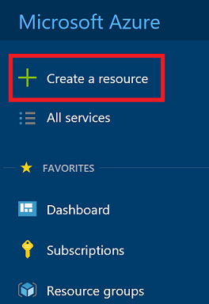


Select **Ubuntu** Server 

 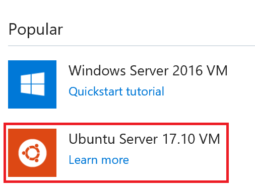


Create server in its own resource group. You can delete the resource group after the lab is competed.

 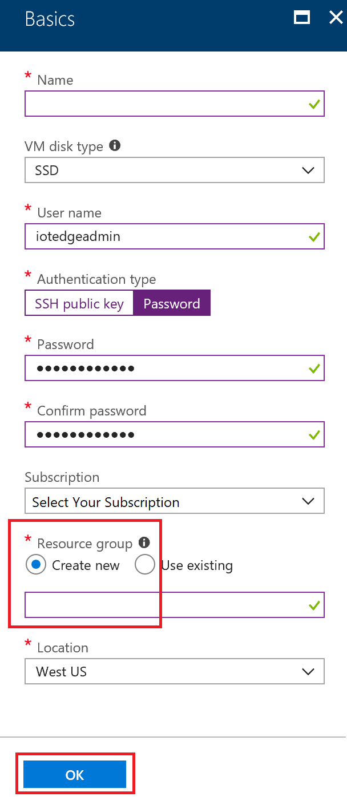


Select DS1_V2 for VM Size

 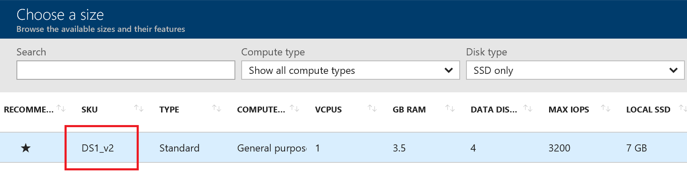


Leave everything default

 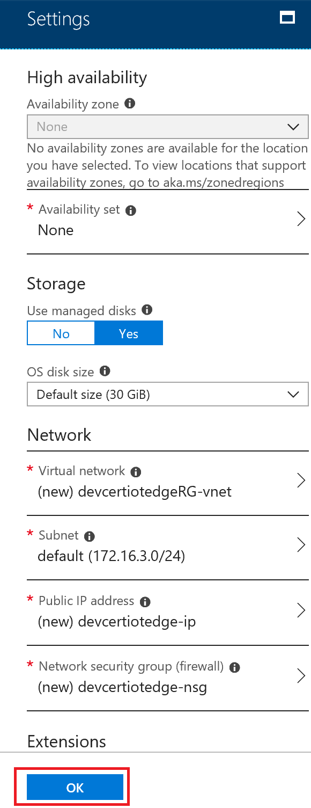
 

Click **Create** button

 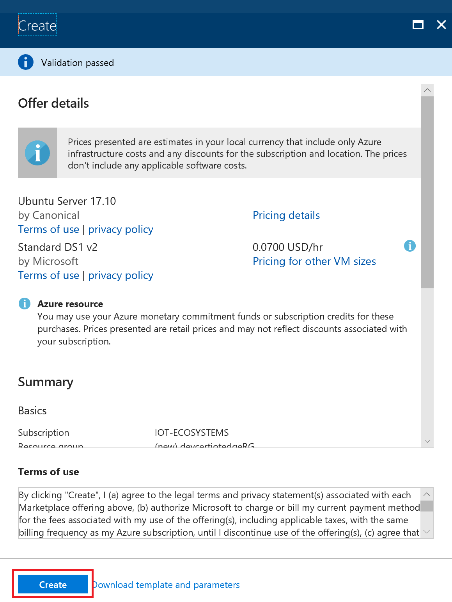

 
Got To the Resource Group created for IoT Edge and select the VM. Click **Connect** button to get the ssh command to connect to the VM.

 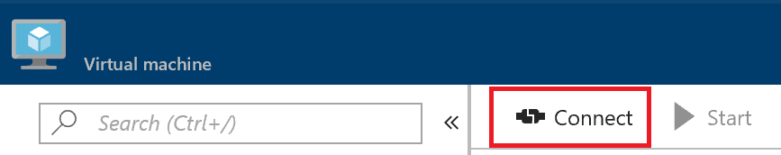


Copy the SSH command

 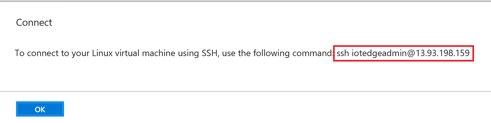

 
Click on Cloud shell in the portal

 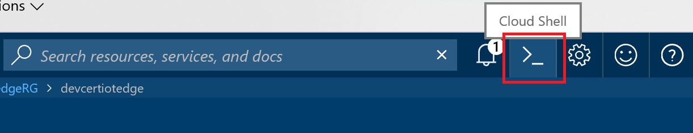

 
Make sure you select **Bash** shell

 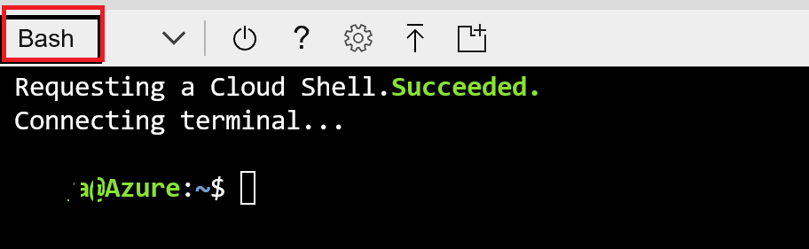

 
Once logged into Cloud Shell type the command 

```linux
$ ssh iotedgeadmin@ipaddress
```


You will be prompted to enter the password which you entered when creating the Ubuntu VM. Enter the password and press enter.

You will successfully login to Ubuntu VM

 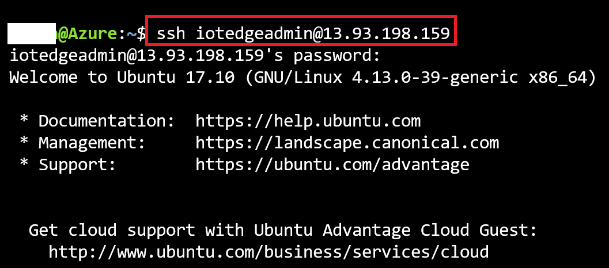


Change user to get root access by entering the following command

```linux
sudo su -
```

Check for Python version, you should have 2.7.X version.

```linux
python --version
```

Update the apt package index

```linux
apt install docker.io
```

Update the apt package index.

Check for docker version

```linux
docker --version
```

You should have a docker version installed.

## Install IoT Edge Runtime

Install pip

```linux
sudo apt-get install python-pip
```

Install IoT Edge Runtime

```linux
sudo pip install -U azure-iot-edge-runtime-ctl
```

Check IoT Edge Runtime version

```linux
iotedgectl --version
```

## Manage IoT Edge Devices using IoTHub

Create IoT Edge Device using IoT Hub. Click on **IoT Edge** from Azure Portal. 

 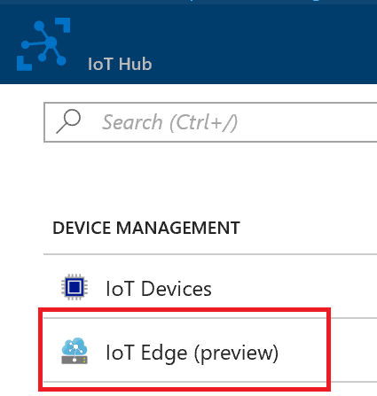


Click on **+ Add IoT Edge Device**


 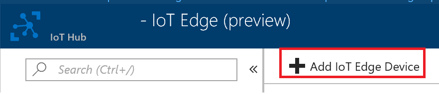


Add new IoT Edge device and Click **Save**

 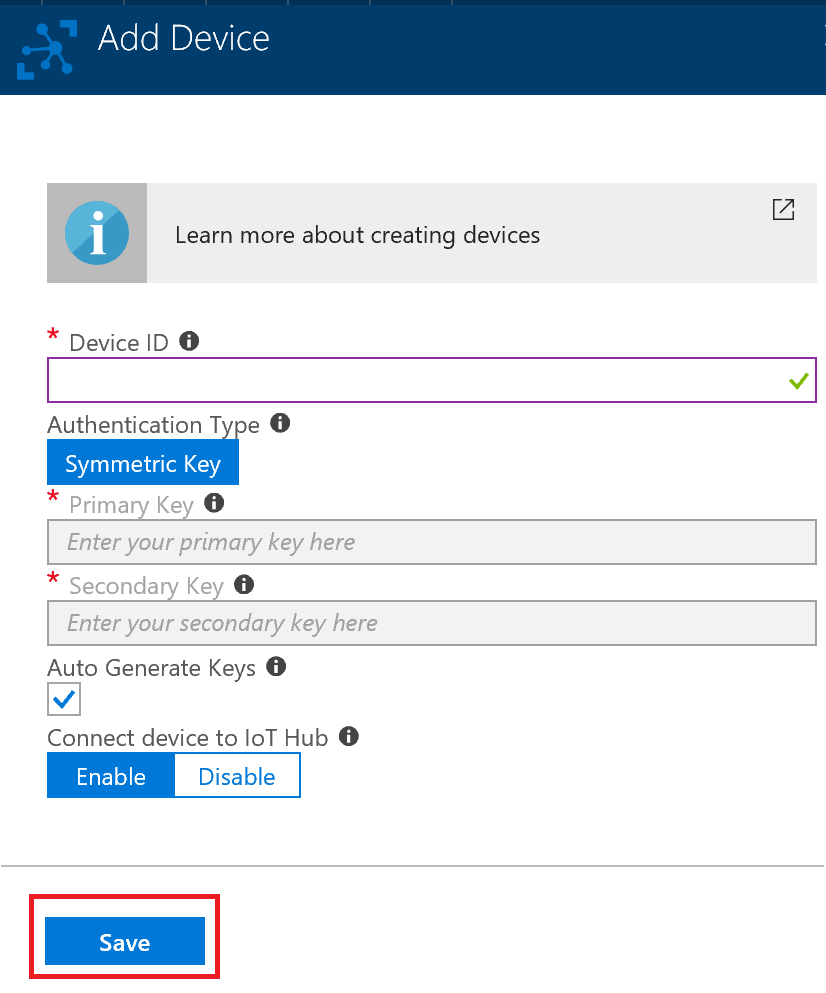


New Edge Device is created. Click on the device

 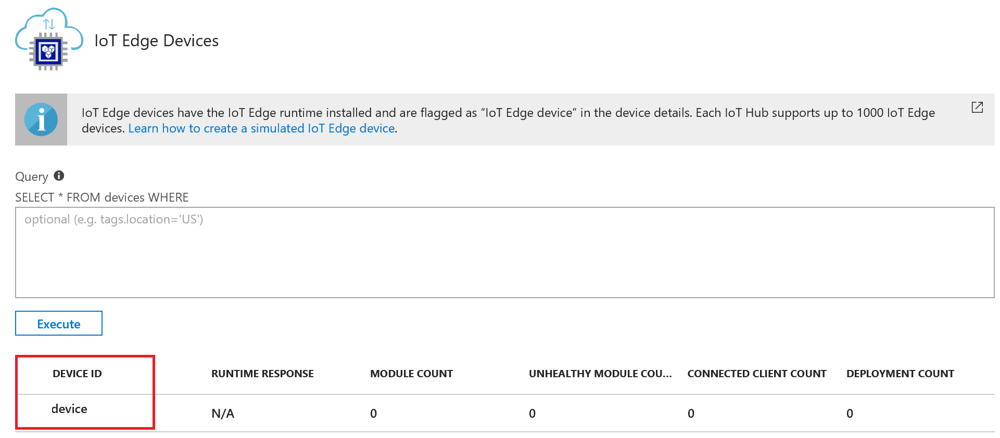


Copy primary connection string

 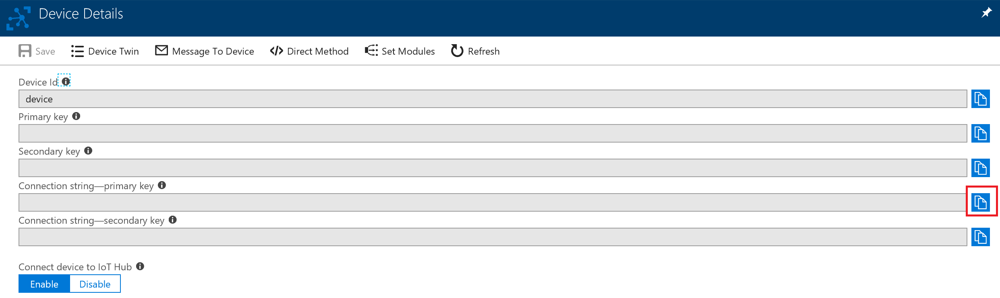


Setup Device with the following command. Make sure replace device connection string with the primary connection string you copied.

```linux
iotedgectl setup --connection-string "{device connection string}" --nopass
```

 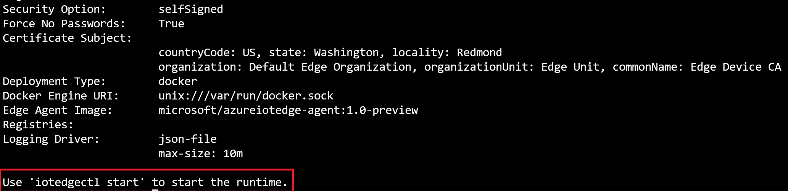


Start the runtime with

```linux
iotedgectl start
```

 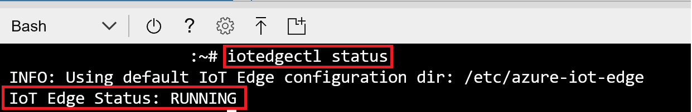


Check Docker to see that the IoT Edge agent is running as a module

```linux
docker ps
```

 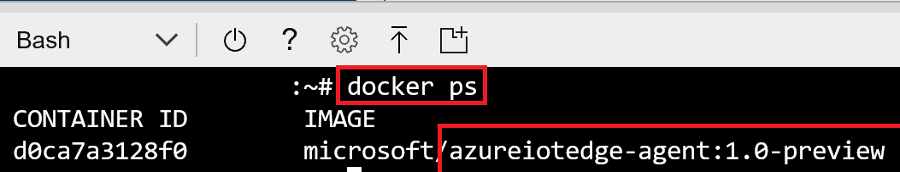

## Deploy a module

One of the key capabilities of Azure IoT Edge is being able to deploy modules to your IoT Edge devices from the cloud. An IoT Edge module is an executable package implemented as a container. In this section, you deploy a module that generates telemetry for your simulated device. 

* In the Azure portal, navigate to your IoT hub.
* Go to IoT Edge (preview) and select your IoT Edge device.
* Select Set Modules.
* Select Add IoT Edge Module.
* In the Name field, enter tempSensor. 
* In the Image URI field, enter microsoft/azureiotedge-simulated-temperature-sensor:1.0-preview. 
* Leave the other settings unchanged, and select Save.

 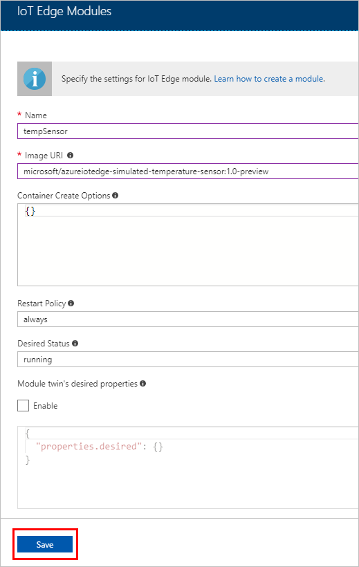


* Back in the Add modules step, select **Next**.
* In the Specify routes step, select **Next**.
* In the Review template step, select **Submit**.
* Return to the device details page and select **Refresh**. You should see the new tempSensor module running along the IoT Edge runtime.


 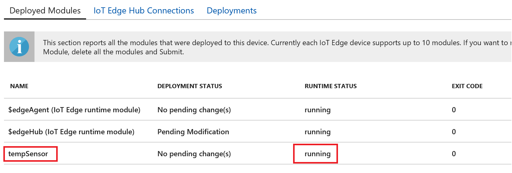


On the edge device type **docker ps** to list all the modules running. You should see tempSensor module running

```linux
docker ps
```

 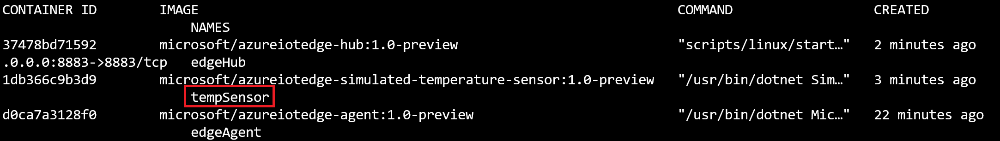


View logs of tempSensor module to see the data being sent to IoT Hub

```linux
docker logs -f tempSensor
```

 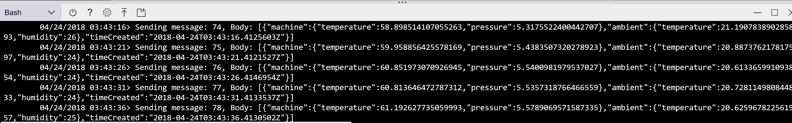

