# Introduction to IoT Edge

IoT devices can produce large quantities of data. To reduce the amount of uploaded data or to eliminate the round-trip latency of an actionable insight, the data must sometimes be analyzed or processed before it reaches the cloud.

Azure IoT Edge takes advantage of pre-built Azure service IoT Edge modules for quick deployment. Azure Stream Analytics is one such module. You can create an Azure Stream Analytics job from its portal and then go to the Azure IoT Hub portal to deploy it as an IoT Edge module.

Azure Stream Analytics provides a richly structured query syntax for data analysis both in the cloud and on IoT
Edge devices.

In this lab you will learn about

* Create an Azure Stream Analytics job to process data on the edge.

* Connect the new Azure Stream Analytics job with other IoT Edge modules.

* Deploy the Azure Stream Analytics job to an IoT Edge device

tempSensor module which you deployed in the previous lab generates simulated temperature data from 20 to 120 degrees, incremented by 1 every 5 seconds.

You will create a Stream Analytics module that resets the tempSensor when the 30-second average reaches 70. In a real scenario, you might use this functionality to shut off a machine or take preventative measures when the temperature reaches dangerous levels.

## Create an Azure Stream Analytics Job

In Azure portal click on **Create a resource**

 

Click on **Internet of Things**

 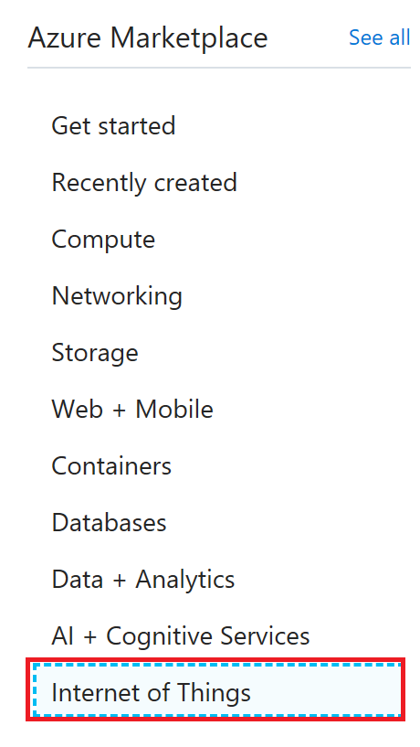

Click on **Stream Analytics Job**

 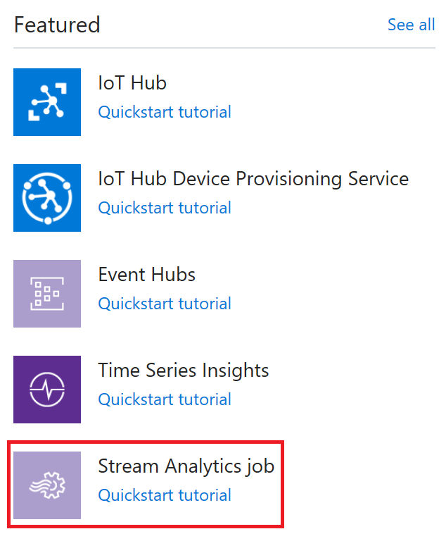

Create **Stream Analytics Job**, make sure to select Edge as the hosting environment. Click **Create** button.

 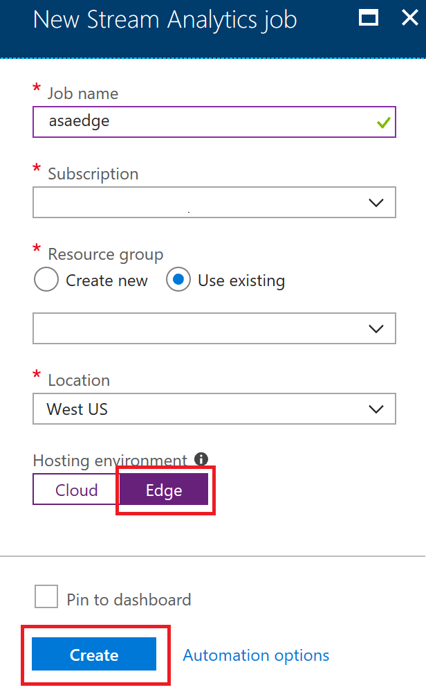

Go To Stream Analytics job you created above and click on **Inputs**. You will be given an option to select Edge Hub as the input. For Stream analytics jobs the only option available for Input is Edge Hub since modules communicate with each other through edge hub.

 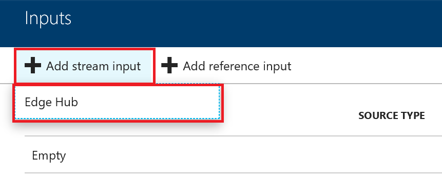

Click **Save** to save the input

 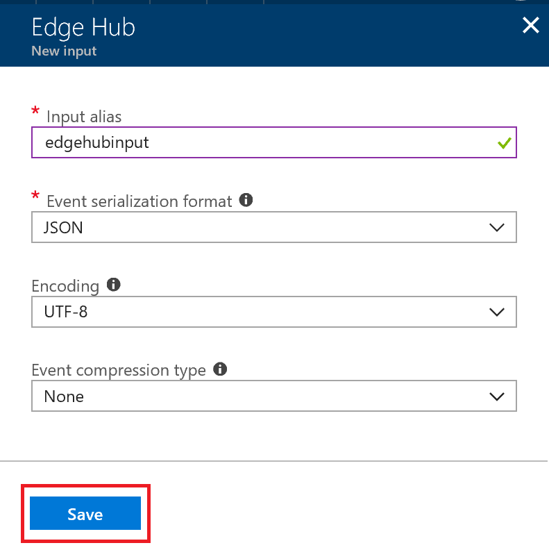

Click on **Outputs**. You will be given an option to select Edge Hub as the output. For Stream analytics jobs the only option available for Output is Edge Hub since modules communicate with each other through edge hub.

 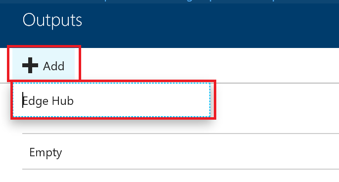

Click **Save** to save the output

 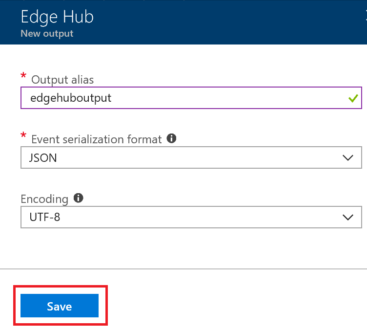

Under **Job Topology**, select **Query**, and then replace the default text with the following query

A Stream Analytics module that resets the tempSensor when the 30-second average reaches 70. Output generates **reset** when the condition is met.

```sql
SELECT
    'reset' AS command
INTO
   edgehuboutput
FROM
   edgehubinput TIMESTAMP BY timeCreated
GROUP BY TumblingWindow(second,30)
HAVING Avg(machine.temperature) > 70
```


Your Stream analytics job

 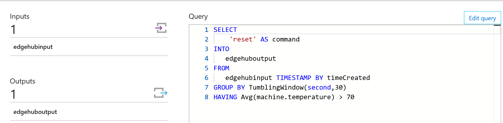

Go To IoT Hub and click on IoT Edge under device management

 

Click on the device and click on **Set Modules**

 

Click on **Import Stream Analytics IoT Edge Module**. Select existing storage account and create a new storage container. Click **Save**

 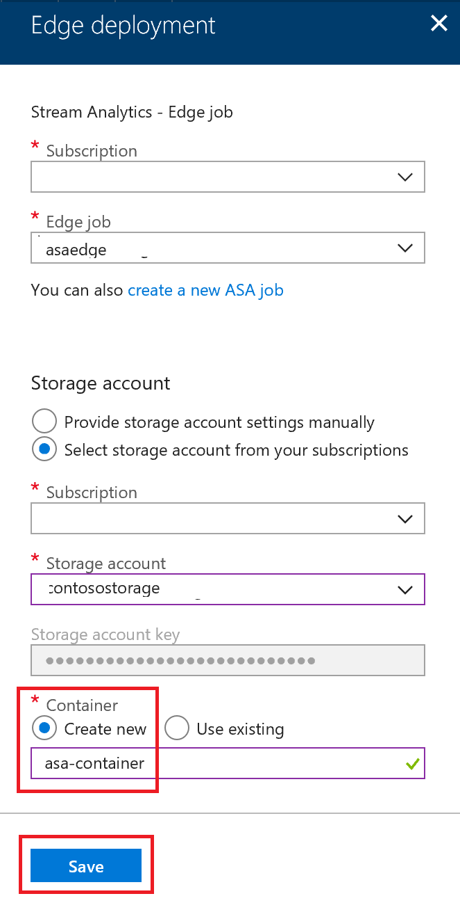

Click **Next** and copy the below routes. Replace the **moduleName** with your module name. In this case it would be **devcertasaedge** and input to Stream analytics job is **edgehubinput** created in previous steps

```json
{
    {
  "routes": {
    "telemetryToCloud": "FROM /messages/modules/tempSensor/* INTO $upstream",
    "alertsToCloud": "FROM /messages/modules/asaedge/* INTO $upstream",
    "alertsToReset": "FROM /messages/modules/asaedge/* INTO BrokeredEndpoint(\"/modules/tempSensor/inputs/control\")",
    "telemetryToAsa": "FROM /messages/modules/tempSensor/* INTO BrokeredEndpoint(\"/modules/asaedge/inputs/edgehubinput\")"
  }
}
}
```

Routes above  do the following

* **telemetryToCloud**: send data from tempSensor module output to IoT Hub
* **alertsToCloud**: send data from stream analytics module output to IoT Hub
* **alertsToReset**: send data from stream analytics module output to tempSensor module endpoint /inputs/control
* **telemetryToAsa**: send data from tempSensor module output to stream analytics input endpoint

 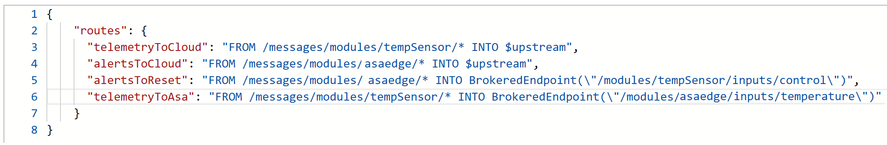

Click **Next** and **Submit**. Stream analytics job will be deployed to the edge.

 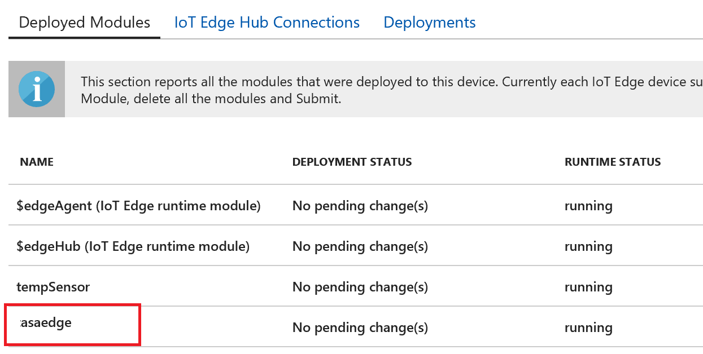

Go To Ubuntu machine and type. Stream analytics module will be running

```linux
docker ps
```

 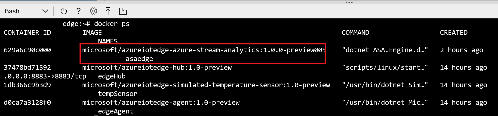

When temperature goes beyond 70 in a 30 second window Stream analytics job will issue a **reset** which will invoke an endpoint on the tempSensor endpoint. Temperature will be reset to 20.

```linux
docker logs -f tempSensor
docker logs -f devcertasaedge
```

 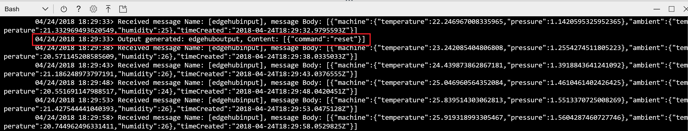
